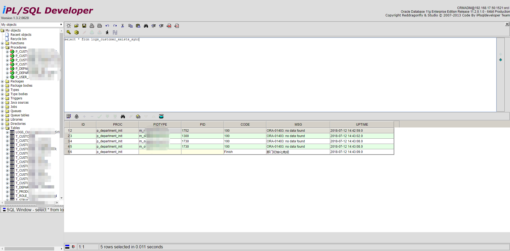

## 说明

### 版权说明

本项目基于[红蜻蜓工作室](http://www.reddragonfly.org)的开源项目[iPL/SQL Developer](https://sourceforge.net/projects/iplsqldeveloper/)进行后期开发(版本: [iplsqldevJ_1_1_0](https://sourceforge.net/p/iplsqldeveloper/code-0/HEAD/tree/iplsqldevJ_1_1_0/))。

由于官方`iPL/SQL Developer`很久未进行更新, 因此AEZOCN团队按照自己的使用习惯进行了相应的改造, 出此版本仅供学习

### 界面展示



### 功能说明

- **支持执行选中语句**
- 支持多页面执行语句
- **支持分页**
- 支持排序
- **支持结果导出(excel)**
- 支持历史语句缓存

### 代码说明

- 执行SQL
    - 页面`WebRoot/login/editortoolbar.jsp`
    - `executeRun(textareaname)`(other.js)
    - `executeSQL(textareaname)`(other.js) 判断执行SQL类型：查询/插入/删除等
    - `getResultFromSql(localsql)`(baisworksql.js)
        
        ```html
        <!--
          BaisWorkBean.GetResultList(sqlNum, callbackadd); // 是基于dwr框架(dwr.jar)完成
        -->
        <script type='text/javascript' src='../dwr/interface/BaisWorkBean.js'></script>
        <script type='text/javascript' src='../dwr/engine.js'></script>
        ```
    - `org.reddragonfly.iplsqldevj.bean.BaisWorkBean#GetResultList(String[] sqlNum)`
    
### iPL/SQL Developer及红蜻蜓工作室介绍

- 红蜻蜓工作室官网: http://www.reddragonfly.org
- iPL/SQL Developer主页: http://iplsqldeveloper.sourceforge.net/
- iPL/SQL Developer is a reference PL/SQL Developer version of the WEB, according to the pattern all PL/SQL Developer format, can be achieved without the client's database development using JAVA to develop.
- Programming Language: Java (struts2)
- Database Environment: Oracle
- License: Apache License V2.0    